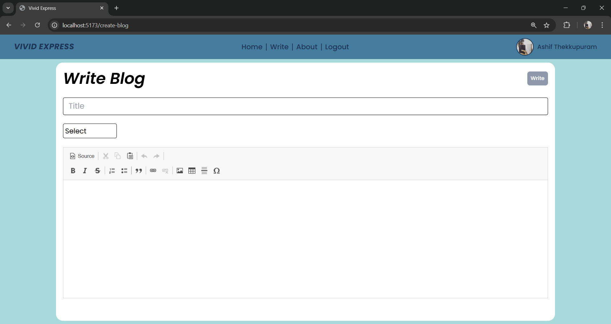

# Vivid Express

Vivid Express is an engaging blog platform built with the MERN stack (MongoDB, Express.js, React, Node.js) and Zustand for state management. It allows users to create, share, and explore blogs, offering a seamless and user-friendly experience for content creators and readers alike.

## Technologies
- MongoDB, Express.js, React.js, Node.js (MERN)
- Axios
- useQuery
- Zustand
- Redux
- React Router Dom
- React Hot Toast
- CK Editor 4

## Features
Login  

  

Register  

  

Home. fetched blogs using useInfiniteQuery and react-intersection-observer useInView to make infinite pagination scrolling possible and also have search and category filter  

  
  

Write blog with CK Editor 4  

  
  

Update Blog  

  

Delete Blog  

  

View Blog  

  

Add Comment  

  

View Commments <bt />

  

Edit Comment  

  

View user and thier blogs  

  

user profile with change profile, name, username and password  

  

Reset Password  

  

Confirm Reset Password  

  
